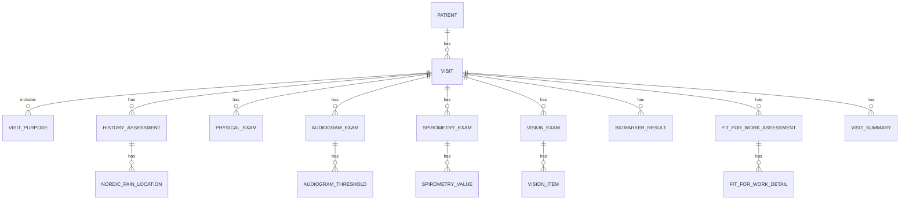

# OccMed EMR Mockup: ER Diagram & Data Model Report

> เอกสารนี้ใช้สำหรับวางใน GitHub repository ของระบบ **OccMed EMR Mockup: Risk-based Health Examination**  
> เป้าหมายคือออกแบบโครงสร้างฐานข้อมูลให้รองรับการตรวจสุขภาพอาชีวอนามัยแบบ modular และขยายต่อได้ในอนาคต

---

## 1. Design Concept

ระบบนี้ควรออกแบบโดยให้ `Visit` เป็นศูนย์กลางของข้อมูลทั้งหมด เพราะผู้รับการตรวจ 1 คนสามารถมาตรวจได้หลายครั้ง เช่น ตรวจประจำปี ตรวจตามความเสี่ยง ตรวจ fit for work หรือมาตรวจติดตามหลังผลผิดปกติ

แนวคิดหลักคือ:

```text
1 Patient สามารถมีได้หลาย Visits
1 Visit สามารถมีได้หลาย Module
แต่ละ Module เก็บข้อมูลเฉพาะของตนเอง
```

ตัวอย่าง module ในระบบ:

- Purpose / Assessment
- History assessment
- Nordic musculoskeletal pain location
- Physical examination
- Audiogram
- Spirometry
- Vision screening test
- Biomarker
- Fit for work
- Final summary

---

## 2. High-level ER Diagram

GitHub รองรับ Mermaid diagram ใน Markdown โดยตรง



---

## 3. Recommended Tables

### 3.1 Core tables

#### `patients`

เก็บข้อมูลประจำตัวของผู้รับการตรวจ

| Field | Type | Description |
|---|---|---|
| `patient_id` | UUID / INT | Primary key |
| `hn` | VARCHAR | Hospital number หรือรหัสพนักงาน |
| `name` | VARCHAR | ชื่อ-สกุล |
| `sex` | VARCHAR | เพศ |
| `date_of_birth` | DATE | วันเกิด |
| `department` | VARCHAR | หน่วยงาน |
| `job_title` | VARCHAR | ตำแหน่งงาน |
| `created_at` | DATETIME | วันที่สร้าง record |

Relationship:

```text
patients.patient_id 1 ---- many visits.patient_id
```

---

#### `visits`

เก็บข้อมูลการมาตรวจแต่ละครั้ง

| Field | Type | Description |
|---|---|---|
| `visit_id` | UUID / INT | Primary key |
| `patient_id` | UUID / INT | Foreign key to patients |
| `visit_date` | DATE | วันที่ตรวจ |
| `risk_description` | TEXT | ปัจจัยเสี่ยง/ลักษณะงาน |
| `doctor_note` | TEXT | หมายเหตุแพทย์ |
| `created_at` | DATETIME | วันที่สร้าง record |

---

## 4. Purpose / Assessment

#### `visit_purposes`

เก็บว่าวันนี้ตรวจด้วย purpose อะไรบ้าง เช่น surveillance หรือ fit for work

| Field | Type | Description |
|---|---|---|
| `visit_purpose_id` | UUID / INT | Primary key |
| `visit_id` | UUID / INT | Foreign key to visits |
| `purpose_type` | VARCHAR | ประเภท purpose |

Recommended values:

```text
surveillance
fit_for_work
```

เหตุผลที่แยกเป็น table เพราะ 1 visit อาจมีมากกว่า 1 purpose ได้

---

## 5. History Assessment

#### `history_assessments`

เก็บข้อมูลซักประวัติทุกหัวข้อในรูปแบบเดียวกัน คือ status + detail

| Field | Type | Description |
|---|---|---|
| `history_id` | UUID / INT | Primary key |
| `visit_id` | UUID / INT | Foreign key to visits |
| `history_type` | VARCHAR | ประเภทการซักประวัติ |
| `status` | VARCHAR | normal / abnormal |
| `detail` | TEXT | รายละเอียด |
| `created_at` | DATETIME | วันที่บันทึก |

Recommended `history_type` values:

```text
irritation
cold_exposure
nordic_msd
computer_vision_syndrome
npc_screening
hand_numbness
```

Recommended `status` values:

```text
normal
abnormal
```

ตัวอย่างข้อมูล:

| visit_id | history_type | status | detail |
|---|---|---|---|
| V001 | irritation | normal | ไม่พบอาการระคายเคือง |
| V001 | cold_exposure | abnormal | ปลายนิ้วซีดเวลาเข้าห้องเย็น |
| V001 | nordic_msd | abnormal | ปวดคอและหลังส่วนบนหลังทำงานคอมพิวเตอร์นาน |

---

### 5.1 Nordic Pain Location

#### `nordic_pain_locations`

เก็บตำแหน่งปวดที่เลือกจาก body map ของ Nordic questionnaire  
ควรแยกออกจาก `history_assessments` เพราะ 1 Nordic assessment สามารถเลือกได้หลายตำแหน่ง

| Field | Type | Description |
|---|---|---|
| `pain_location_id` | UUID / INT | Primary key |
| `history_id` | UUID / INT | Foreign key to history_assessments |
| `body_region` | VARCHAR | ตำแหน่งอาการปวด |
| `side` | VARCHAR | left / right / both / not_specified |
| `note` | TEXT | หมายเหตุเพิ่มเติม |

Recommended `body_region` values:

```text
neck
shoulder
upper_back
lower_back
elbow
wrist_hand
hip_thigh
knee
ankle_foot
```

Recommended `side` values:

```text
left
right
both
not_specified
```

---

## 6. Physical Examination

#### `physical_exams`

เก็บตรวจร่างกายแบบ long format เพื่อให้เพิ่มระบบใหม่ได้ง่าย

| Field | Type | Description |
|---|---|---|
| `pe_id` | UUID / INT | Primary key |
| `visit_id` | UUID / INT | Foreign key to visits |
| `system_name` | VARCHAR | ชื่อระบบที่ตรวจ |
| `status` | VARCHAR | normal / abnormal |
| `detail` | TEXT | รายละเอียดความผิดปกติ |

Recommended `system_name` values:

```text
GA
HEENT
CVS
Respi
Abd
Neuro
Skin
Ext
Other
```

ตัวอย่างข้อมูล:

| visit_id | system_name | status | detail |
|---|---|---|---|
| V001 | GA | normal |  |
| V001 | HEENT | abnormal | nasal mucosa injected |
| V001 | CVS | normal |  |

---

## 7. Audiogram

Audiogram ควรแยกเป็น exam หลักและ threshold ราย frequency  
ไม่แนะนำให้เก็บเป็น column เช่น `R500`, `R1000`, `L500` เพราะแก้ไขยากเมื่อเพิ่ม frequency ใหม่

### 7.1 `audiogram_exams`

| Field | Type | Description |
|---|---|---|
| `audiogram_id` | UUID / INT | Primary key |
| `visit_id` | UUID / INT | Foreign key to visits |
| `interpretation` | TEXT | แปลผล |
| `baseline_opinion` | TEXT | สรุปเทียบ baseline |
| `advice` | TEXT | คำแนะนำ |

### 7.2 `audiogram_thresholds`

| Field | Type | Description |
|---|---|---|
| `threshold_id` | UUID / INT | Primary key |
| `audiogram_id` | UUID / INT | Foreign key to audiogram_exams |
| `ear` | VARCHAR | right / left |
| `test_set` | VARCHAR | baseline / current / confirmed |
| `frequency_hz` | INT | ความถี่ เช่น 500, 1000, 2000 |
| `threshold_db` | DECIMAL | ค่า hearing threshold dB |

Recommended `ear` values:

```text
right
left
```

Recommended `test_set` values:

```text
baseline
current
confirmed
```

Recommended `frequency_hz` values:

```text
500
1000
2000
3000
4000
6000
8000
```

---

## 8. Spirometry

Spirometry ควรแยกเป็น exam หลักและ parameter value  
เหมาะกับ logic ที่เพิ่งปรับใหม่ คือเลือกผลเป็น `ปกติ`, `แปลผลไม่ได้`, หรือ `ผิดปกติ`

### 8.1 `spirometry_exams`

| Field | Type | Description |
|---|---|---|
| `spirometry_id` | UUID / INT | Primary key |
| `visit_id` | UUID / INT | Foreign key to visits |
| `result_status` | VARCHAR | normal / uninterpretable / abnormal |
| `abnormal_type` | VARCHAR | obstructive / restrictive / mixed |
| `severity_level` | VARCHAR | mild / moderate / severe |
| `baseline_opinion` | TEXT | สรุปเทียบ baseline |
| `advice` | TEXT | คำแนะนำ |

Recommended `result_status` values:

```text
normal
uninterpretable
abnormal
```

Recommended `abnormal_type` values:

```text
obstructive
restrictive
mixed
```

Recommended `severity_level` values:

```text
mild
moderate
severe
```

หมายเหตุ:

- ถ้า `result_status = normal` ให้ `abnormal_type` และ `severity_level` เป็น null
- ถ้า `result_status = uninterpretable` ให้ `abnormal_type` และ `severity_level` เป็น null
- ถ้า `result_status = abnormal` จึงควรมี `abnormal_type` และ `severity_level`

### 8.2 `spirometry_values`

| Field | Type | Description |
|---|---|---|
| `spiro_value_id` | UUID / INT | Primary key |
| `spirometry_id` | UUID / INT | Foreign key to spirometry_exams |
| `parameter_name` | VARCHAR | FEV1 / FVC / FEV1_FVC |
| `value_type` | VARCHAR | baseline / current |
| `measured_value` | DECIMAL | ค่าที่วัดได้ |
| `percent_predicted` | DECIMAL | % predicted |

Recommended `parameter_name` values:

```text
FEV1
FVC
FEV1_FVC
```

Recommended `value_type` values:

```text
baseline
current
```

ตัวอย่างข้อมูล:

| parameter_name | value_type | measured_value | percent_predicted |
|---|---|---:|---:|
| FEV1 | baseline | 2.92 | 93 |
| FEV1 | current | 2.76 | 88 |
| FVC | baseline | 3.42 | 95 |
| FVC | current | 3.35 | 93 |

---

## 9. Vision Screening Test

Vision screening ควรแยกเป็น exam หลักและ item ย่อย เพราะมีหลาย component เช่น far vision, near vision, color vision, visual field และ depth perception

### 9.1 `vision_exams`

| Field | Type | Description |
|---|---|---|
| `vision_id` | UUID / INT | Primary key |
| `visit_id` | UUID / INT | Foreign key to visits |
| `interpretation` | TEXT | แปลผล |
| `summary` | TEXT | สรุปความสามารถในการทำงาน |
| `advice` | TEXT | คำแนะนำ |

### 9.2 `vision_items`

| Field | Type | Description |
|---|---|---|
| `vision_item_id` | UUID / INT | Primary key |
| `vision_id` | UUID / INT | Foreign key to vision_exams |
| `item_name` | VARCHAR | รายการตรวจ |
| `right_eye` | VARCHAR | ผลตาขวา |
| `left_eye` | VARCHAR | ผลตาซ้าย |
| `both_eyes` | VARCHAR | ผลสองตา |
| `status` | VARCHAR | normal / abnormal / not_tested |
| `note` | TEXT | หมายเหตุ |

Recommended `item_name` values:

```text
far_vision
near_vision
color_vision
visual_field
depth_perception
```

---

## 10. Biomarker

#### `biomarker_results`

เก็บ biomarker เป็น long format เพราะ 1 visit สามารถตรวจหลายสารได้

| Field | Type | Description |
|---|---|---|
| `biomarker_id` | UUID / INT | Primary key |
| `visit_id` | UUID / INT | Foreign key to visits |
| `chemical` | VARCHAR | สารเคมีต้นเหตุ |
| `biomarker_name` | VARCHAR | ชื่อ biomarker |
| `result_value` | DECIMAL / VARCHAR | ผลตรวจ |
| `unit` | VARCHAR | หน่วย |
| `reference_value` | VARCHAR | ค่าอ้างอิง |
| `timing` | VARCHAR | เวลาที่ควรเก็บ sample |
| `interpretation` | TEXT | แปลผล |

ตัวอย่างข้อมูล:

| chemical | biomarker_name | result_value | unit | interpretation |
|---|---|---:|---|---|
| Benzene | t,t-Muconic acid in urine | 380 | µg/g creatinine | อยู่ในเกณฑ์อ้างอิง |
| Lead | Lead in blood | 110 | µg/L | อยู่ในเกณฑ์อ้างอิง |
| Cadmium | Cadmium in urine | 6.2 | µg/g creatinine | สูงกว่าเกณฑ์อ้างอิง |

---

## 11. Fit for Work

Fit for work ควรแยกเป็น assessment หลักและ detail ย่อย  
เพราะ category เช่น confined space, driver และ food handler ใช้รายการตรวจไม่เหมือนกัน

### 11.1 `fit_for_work_assessments`

| Field | Type | Description |
|---|---|---|
| `fit_id` | UUID / INT | Primary key |
| `visit_id` | UUID / INT | Foreign key to visits |
| `category` | VARCHAR | confined_space / driver / food_handler |
| `fit_result` | VARCHAR | fit / fit_with_restriction / unfit / pending |
| `restriction` | TEXT | ข้อจำกัด |
| `note` | TEXT | หมายเหตุ |

Recommended `category` values:

```text
confined_space
driver
food_handler
```

Recommended `fit_result` values:

```text
fit
fit_with_restriction
unfit
pending
```

### 11.2 `fit_for_work_details`

| Field | Type | Description |
|---|---|---|
| `fit_detail_id` | UUID / INT | Primary key |
| `fit_id` | UUID / INT | Foreign key to fit_for_work_assessments |
| `item_name` | VARCHAR | รายการตรวจ |
| `result_value` | TEXT | ผลตรวจ |
| `status` | VARCHAR | normal / abnormal / not_tested |
| `note` | TEXT | หมายเหตุ |

ตัวอย่าง detail สำหรับ Driver:

| item_name | result_value | status |
|---|---|---|
| blood_pressure | 128/78 mmHg | normal |
| fbs | 94 mg/dL | normal |
| ecg | normal | normal |
| amphetamine | not detected | normal |
| mental_health | normal | normal |

ตัวอย่าง detail สำหรับ Food handler:

| item_name | result_value | status |
|---|---|---|
| diarrhea_history | no | normal |
| jaundice_history | no | normal |
| stool_exam | normal | normal |
| stool_culture | normal | normal |
| anti_hav_igm | negative | normal |
| cxr | normal | normal |

---

## 12. Final Summary

#### `visit_summaries`

แยก summary ออกจาก visit เพราะแพทย์อาจ generate ใหม่หรือแก้ไขหลายครั้ง

| Field | Type | Description |
|---|---|---|
| `summary_id` | UUID / INT | Primary key |
| `visit_id` | UUID / INT | Foreign key to visits |
| `summary_text` | TEXT | สรุปผลการตรวจ |
| `created_by` | VARCHAR | ผู้สร้าง summary |
| `created_at` | DATETIME | วันที่สร้าง |
| `version` | INT | version ของ summary |

---

## 13. Minimum Viable Database

ถ้าเริ่มทำ version แรก แนะนำให้มี table เหล่านี้ก่อน

```text
patients
visits
visit_purposes
history_assessments
nordic_pain_locations
physical_exams
audiogram_exams
audiogram_thresholds
spirometry_exams
spirometry_values
vision_exams
vision_items
biomarker_results
fit_for_work_assessments
fit_for_work_details
visit_summaries
```

ยังไม่จำเป็นต้องแยก master table เช่น `departments`, `jobs`, `doctors`, `companies` ในช่วงแรก  
เพราะจะทำให้ระบบซับซ้อนเกินไปสำหรับ mockup

---

## 14. Example JSON Structure for Frontend

ตัวอย่างนี้ใช้เป็นแนวคิดสำหรับบันทึกข้อมูลจาก HTML form ก่อนส่งไป backend หรือ Google Sheets

```json
{
  "patient": {
    "hn": "HN001",
    "name": "นายไผ่",
    "sex": "ชาย",
    "department": "RFS - ซ่อมบำรุง",
    "job_title": "ช่างซ่อมบำรุง"
  },
  "visit": {
    "visit_date": "2026-06-15",
    "risk_description": "สัมผัสเสียงดังจากเครื่องจักร",
    "doctor_note": ""
  },
  "purposes": [
    "surveillance"
  ],
  "histories": [
    {
      "history_type": "irritation",
      "status": "normal",
      "detail": "ไม่พบอาการระคายเคือง"
    },
    {
      "history_type": "nordic_msd",
      "status": "abnormal",
      "detail": "ปวดหลังส่วนล่างหลังยืนทำงานนาน",
      "pain_locations": [
        {
          "body_region": "lower_back",
          "side": "not_specified"
        }
      ]
    }
  ],
  "physical_exams": [
    {
      "system_name": "GA",
      "status": "normal",
      "detail": ""
    },
    {
      "system_name": "HEENT",
      "status": "normal",
      "detail": ""
    }
  ],
  "spirometry": {
    "result_status": "abnormal",
    "abnormal_type": "obstructive",
    "severity_level": "mild",
    "baseline_opinion": "ไม่มีการเปลี่ยนแปลงของสมรรถภาพปอดเมื่อเทียบกับ baseline อย่างมีนัยสำคัญ",
    "values": [
      {
        "parameter_name": "FEV1",
        "value_type": "baseline",
        "measured_value": 2.92,
        "percent_predicted": 93
      },
      {
        "parameter_name": "FEV1",
        "value_type": "current",
        "measured_value": 2.76,
        "percent_predicted": 88
      }
    ]
  }
}
```

---

## 15. Optional PostgreSQL-style DDL Draft

> DDL นี้เป็น draft สำหรับเริ่มต้น ไม่ใช่ final production schema

```sql
CREATE TABLE patients (
    patient_id UUID PRIMARY KEY,
    hn VARCHAR(50) UNIQUE NOT NULL,
    name VARCHAR(255),
    sex VARCHAR(50),
    date_of_birth DATE,
    department VARCHAR(255),
    job_title VARCHAR(255),
    created_at TIMESTAMP DEFAULT CURRENT_TIMESTAMP
);

CREATE TABLE visits (
    visit_id UUID PRIMARY KEY,
    patient_id UUID REFERENCES patients(patient_id),
    visit_date DATE NOT NULL,
    risk_description TEXT,
    doctor_note TEXT,
    created_at TIMESTAMP DEFAULT CURRENT_TIMESTAMP
);

CREATE TABLE visit_purposes (
    visit_purpose_id UUID PRIMARY KEY,
    visit_id UUID REFERENCES visits(visit_id),
    purpose_type VARCHAR(100) NOT NULL
);

CREATE TABLE history_assessments (
    history_id UUID PRIMARY KEY,
    visit_id UUID REFERENCES visits(visit_id),
    history_type VARCHAR(100) NOT NULL,
    status VARCHAR(50),
    detail TEXT,
    created_at TIMESTAMP DEFAULT CURRENT_TIMESTAMP
);

CREATE TABLE nordic_pain_locations (
    pain_location_id UUID PRIMARY KEY,
    history_id UUID REFERENCES history_assessments(history_id),
    body_region VARCHAR(100),
    side VARCHAR(50),
    note TEXT
);

CREATE TABLE physical_exams (
    pe_id UUID PRIMARY KEY,
    visit_id UUID REFERENCES visits(visit_id),
    system_name VARCHAR(100),
    status VARCHAR(50),
    detail TEXT
);

CREATE TABLE audiogram_exams (
    audiogram_id UUID PRIMARY KEY,
    visit_id UUID REFERENCES visits(visit_id),
    interpretation TEXT,
    baseline_opinion TEXT,
    advice TEXT
);

CREATE TABLE audiogram_thresholds (
    threshold_id UUID PRIMARY KEY,
    audiogram_id UUID REFERENCES audiogram_exams(audiogram_id),
    ear VARCHAR(50),
    test_set VARCHAR(50),
    frequency_hz INT,
    threshold_db DECIMAL(5,2)
);

CREATE TABLE spirometry_exams (
    spirometry_id UUID PRIMARY KEY,
    visit_id UUID REFERENCES visits(visit_id),
    result_status VARCHAR(50),
    abnormal_type VARCHAR(50),
    severity_level VARCHAR(50),
    baseline_opinion TEXT,
    advice TEXT
);

CREATE TABLE spirometry_values (
    spiro_value_id UUID PRIMARY KEY,
    spirometry_id UUID REFERENCES spirometry_exams(spirometry_id),
    parameter_name VARCHAR(100),
    value_type VARCHAR(50),
    measured_value DECIMAL(10,2),
    percent_predicted DECIMAL(10,2)
);

CREATE TABLE vision_exams (
    vision_id UUID PRIMARY KEY,
    visit_id UUID REFERENCES visits(visit_id),
    interpretation TEXT,
    summary TEXT,
    advice TEXT
);

CREATE TABLE vision_items (
    vision_item_id UUID PRIMARY KEY,
    vision_id UUID REFERENCES vision_exams(vision_id),
    item_name VARCHAR(100),
    right_eye VARCHAR(100),
    left_eye VARCHAR(100),
    both_eyes VARCHAR(100),
    status VARCHAR(50),
    note TEXT
);

CREATE TABLE biomarker_results (
    biomarker_id UUID PRIMARY KEY,
    visit_id UUID REFERENCES visits(visit_id),
    chemical VARCHAR(255),
    biomarker_name VARCHAR(255),
    result_value VARCHAR(100),
    unit VARCHAR(100),
    reference_value VARCHAR(255),
    timing VARCHAR(255),
    interpretation TEXT
);

CREATE TABLE fit_for_work_assessments (
    fit_id UUID PRIMARY KEY,
    visit_id UUID REFERENCES visits(visit_id),
    category VARCHAR(100),
    fit_result VARCHAR(100),
    restriction TEXT,
    note TEXT
);

CREATE TABLE fit_for_work_details (
    fit_detail_id UUID PRIMARY KEY,
    fit_id UUID REFERENCES fit_for_work_assessments(fit_id),
    item_name VARCHAR(100),
    result_value TEXT,
    status VARCHAR(50),
    note TEXT
);

CREATE TABLE visit_summaries (
    summary_id UUID PRIMARY KEY,
    visit_id UUID REFERENCES visits(visit_id),
    summary_text TEXT,
    created_by VARCHAR(255),
    created_at TIMESTAMP DEFAULT CURRENT_TIMESTAMP,
    version INT DEFAULT 1
);
```

---

## 16. Suggested GitHub Repository Structure

```text
occmed-emr-mockup/
├── index.html
├── README.md
├── docs/
│   └── er-diagram-report.md
├── database/
│   └── schema.sql
└── assets/
    └── screenshots/
```

Recommended file placement:

| File | Purpose |
|---|---|
| `index.html` | หน้า web mockup สำหรับ GitHub Pages |
| `README.md` | คำอธิบาย project |
| `docs/er-diagram-report.md` | รายงาน ER diagram และ data model |
| `database/schema.sql` | SQL schema draft |
| `assets/screenshots/` | เก็บรูปตัวอย่างหน้าจอ |

---

## 17. Development Notes

### Why use long format?

หลาย module เช่น physical exam, audiogram, spirometry และ biomarker มีลักษณะเป็นรายการซ้ำ  
การเก็บแบบ long format ทำให้ระบบเพิ่มรายการใหม่ได้โดยไม่ต้องเปลี่ยน database structure

ตัวอย่าง:

```text
ไม่ดี:
FEV1_baseline, FEV1_current, FVC_baseline, FVC_current, ...

ดีกว่า:
parameter_name = FEV1
value_type = baseline
measured_value = 2.92
```

### Why keep Visit as the center?

ผลตรวจเปลี่ยนตามเวลา ดังนั้นข้อมูลส่วนใหญ่ควรผูกกับ `visit_id` ไม่ใช่ `patient_id` โดยตรง  
เช่น audiogram ปี 2568 และปี 2569 เป็นคนเดียวกัน แต่เป็นคนละ visit

### Why separate Summary?

Summary เป็นข้อความที่แพทย์แก้ไขได้ และอาจมีหลาย version  
การแยก `visit_summaries` จะช่วยให้เก็บ version หรือ audit trail ได้ง่ายขึ้น

---

## 18. Next Step

ขั้นตอนที่แนะนำหลังจากนี้:

1. ใช้ `index.html` เป็น frontend mockup
2. สร้าง `README.md` เพื่ออธิบาย project
3. ใส่ไฟล์นี้ไว้ที่ `docs/er-diagram-report.md`
4. ถ้าจะต่อ Google Sheets ให้ map แต่ละ form section เป็น JSON ก่อน
5. ถ้าจะต่อ database จริง ให้เริ่มจาก schema ใน `database/schema.sql`
6. ระยะถัดไปค่อยเพิ่ม user login, doctor table, company table และ audit log

---

## 19. Summary

ER model ที่เหมาะกับระบบนี้ควรเป็นแบบ modular และ visit-centered

```text
Patient
  └── Visit
        ├── Purpose
        ├── History
        │     └── Nordic pain location
        ├── Physical exam
        ├── Audiogram
        │     └── Thresholds
        ├── Spirometry
        │     └── Values
        ├── Vision screening
        │     └── Items
        ├── Biomarker
        ├── Fit for work
        │     └── Details
        └── Summary
```

แนวทางนี้ทำให้ระบบเริ่มง่าย แต่ยังขยายต่อได้ เช่น เพิ่ม annual surveillance, abnormal follow-up, company dashboard, หรือ occupational health registry ในอนาคต
